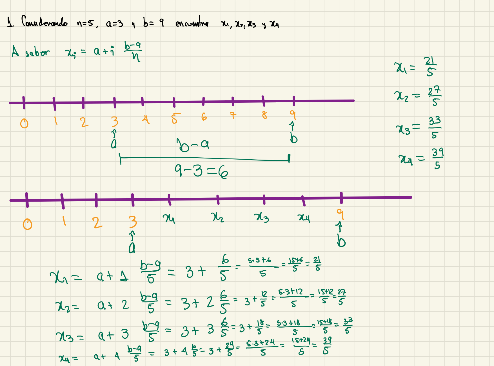
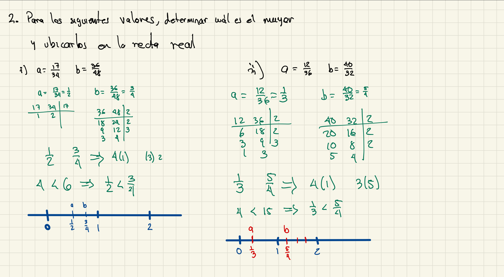
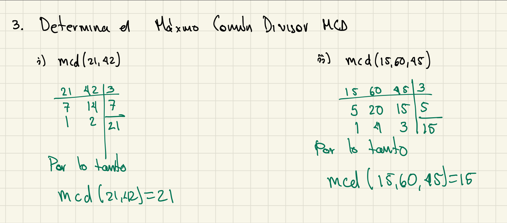
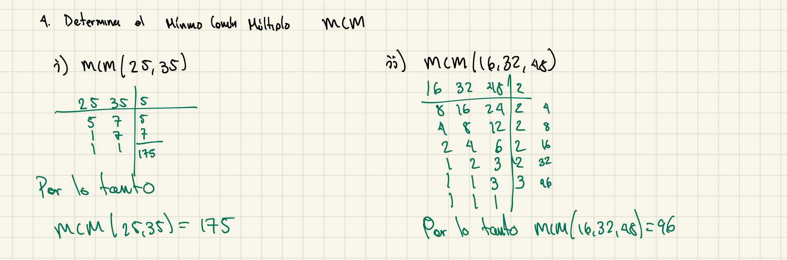

```{r setup, include=FALSE}
knitr::opts_chunk$set(echo = TRUE)
```


\begin{multicols}{2}

Nombre:


Matrícula:


Licenciatura: 

Hora de inicio:

Hora de término:
\end{multicols}


**Resuelve los siguientes ejercicios**\footnote{En matemáticas, no entiendes las cosas. Simplemente te acostumbras a ellas. - \textbf{John von Neumann}}


**Resuelve los siguientes ejercicios**\footnote{Las matemáticas son el único lenguaje que las personas de todos los países pueden entender. - \textbf{Helbert Hubband}}

1. Considerando los siguientes valores de $n,a$ y $b$ proporciona las coordenadas para cada uno de los puntos $x_i$, para $i=1,2,\ldots,n$, es decir: $x_1,x_2,\ldots,x_n$


    i. $n=5, a=3, b=9$, encontrar $x_1,x_2,x_3,x_4$ \textbf{ 1.5 ptos.}
        
**Solución:**

{width=450}

2. Para los siguientes valores determina cuál es el mayor y ubícalos en la recta real

    i. $a = 17/34, b = 36/48$,  \textbf{ 1.5 ptos.}
   
    ii. $a = 12/36, b = 40/32$,  \textbf{ 1.5 ptos.}

{width=450}
        

3. Determina el mínimo común múltiplo **DEBE DECIR MÁXIMO COMÚN DIVISOR**

    i. $m.c.d(21, 42)$ \textbf{ 1.5 ptos.}
  
    ii. $m.c.d(15, 60, 45)$ \textbf{ 2 ptos.}
        
**Solución:**

{width=450}


4. Determina el Máximo Común Divisor **DEBE DECIR MÍNIMO COMÚN MÚLTIPLO**

    i. m.c.m(25, 35) \textbf{ 1.5 ptos.}
  
    ii. m.c.d(16, 32, 48) \textbf{ 2 ptos.}
        
**Solución:**

{width=450}


**La suma total de puntos a considerar es de 10**

